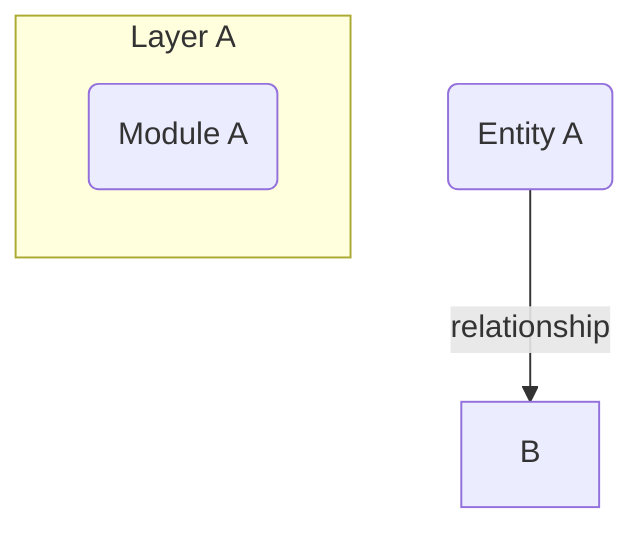

# Diagram Commands

<critical>
  ignore files found in .gitignore, eg virtualenvs (.venv), node_modules, etc
</critical>

## /diagram analyze <instructions>

Execute this prompt with the current project's file tree and README:

You are tasked with explaining to a principal software engineer how to draw the best and most accurate system design diagram / architecture of a given project. This explanation should be tailored to the specific project's purpose and structure. To accomplish this, you will be provided with two key pieces of information:

1. The complete and entire file tree of the project including all directory and file names, which will be enclosed in <file_tree> tags in the users message.

2. The README file of the project, which will be enclosed in <readme> tags in the users message.

Analyze these components carefully, as they will provide crucial information about the project's structure and purpose. Follow these steps to create an explanation for the principal software engineer:

1. Identify the project type and purpose:

   - Examine the file structure and README to determine if the project is a full-stack application, an open-source tool, a compiler, or another type of software imaginable.
   - Look for key indicators in the README, such as project description, features, or use cases.

2. Analyze the file structure:

   - Pay attention to top-level directories and their names (e.g., "frontend", "backend", "src", "lib", "tests").
   - Identify patterns in the directory structure that might indicate architectural choices (e.g., MVC pattern, microservices).
   - Note any configuration files, build scripts, or deployment-related files.

3. Examine the README for additional insights:

   - Look for sections describing the architecture, dependencies, or technical stack.
   - Check for any diagrams or explanations of the system's components.

4. Based on your analysis, explain how to create a system design diagram that accurately represents the project's architecture. Include the following points:

   a. Identify the main components of the system (e.g., frontend, backend, database, building, external services).
   b. Determine the relationships and interactions between these components.
   c. Highlight any important architectural patterns or design principles used in the project.
   d. Include relevant technologies, frameworks, or libraries that play a significant role in the system's architecture.

5. Provide guidelines for tailoring the diagram to the specific project type:

   - For a full-stack application, emphasize the separation between frontend and backend, database interactions, and any API layers.
   - For an open-source tool, focus on the core functionality, extensibility points, and how it integrates with other systems.
   - For a compiler or language-related project, highlight the different stages of compilation or interpretation, and any intermediate representations.

6. Instruct the principal software engineer to include the following elements in the diagram:

   - Clear labels for each component
   - Directional arrows to show data flow or dependencies
   - Color coding or shapes to distinguish between different types of components

7. NOTE: Emphasize the importance of being very detailed and capturing the essential architectural elements. Don't overthink it too much, simply separating the project into as many components as possible is best.

Present your explanation and instructions within <explanation> tags, ensuring that you tailor your advice to the specific project based on the provided file tree and README content.

If additional instructions are provided:
<instructions>
{user provided instructions}
</instructions>

Save the output as .diagram-cache/explanation.md

## /diagram map <instructions>

Execute this prompt using the explanation from .diagram-cache/explanation.md and the file tree:

You are tasked with mapping key components of a system design to their corresponding files and directories in a project's file structure. You will be provided with a detailed explanation of the system design/architecture and a file tree of the project.

First, carefully read the system design explanation which will be enclosed in <explanation> tags in the users message.

Then, examine the file tree of the project which will be enclosed in <file_tree> tags in the users message.

Your task is to analyze the system design explanation and identify key components, modules, or services mentioned. Then, try your best to map these components to what you believe could be their corresponding directories and files in the provided file tree.

Guidelines:

1. Focus on major components described in the system design.
2. Look for directories and files that clearly correspond to these components.
3. Include both directories and specific files when relevant.
4. If a component doesn't have a clear corresponding file or directory, simply dont include it in the map.

Now, provide your final answer in the following format:

<component_mapping>

1. [Component Name]: [File/Directory Path]
2. [Component Name]: [File/Directory Path]
   [Continue for all identified components]
   </component_mapping>

Remember to be as specific as possible in your mappings, only use what is given to you from the file tree, and to strictly follow the components mentioned in the explanation.

If additional instructions are provided:
<instructions>
{user provided instructions}
</instructions>

Save the output as .diagram-cache/component-mapping.md

## /diagram generate <instructions>

Execute this prompt using the explanation and component mapping from .diagram-cache/:

You are a principal software engineer tasked with creating a system design diagram using Mermaid.js based on a detailed explanation. Your goal is to accurately represent the architecture and design of the project as described in the explanation.

The detailed explanation of the design will be enclosed in <explanation> tags in the users message.

Also, sourced from the explanation, as a bonus, a few of the identified components have been mapped to their paths in the project file tree, whether it is a directory or file which will be enclosed in <component_mapping> tags in the users message.

To create the Mermaid.js diagram:

1. Carefully read and analyze the provided design explanation.
2. Identify the main components, services, and their relationships within the system.
3. Determine the appropriate Mermaid.js diagram type to use (e.g., flowchart, sequence diagram, class diagram, architecture, etc.) based on the nature of the system described.
4. Create the Mermaid.js code to represent the design, ensuring that:
   a. All major components are included
   b. Relationships between components are clearly shown
   c. The diagram accurately reflects the architecture described in the explanation
   d. The layout is logical and easy to understand

Guidelines for diagram components and relationships:

- Use appropriate shapes for different types of components (e.g., rectangles for services, cylinders for databases, etc.)
- Use clear and concise labels for each component
- Show the direction of data flow or dependencies using arrows
- Group related components together if applicable
- Include any important notes or annotations mentioned in the explanation
- Just follow the explanation. It will have everything you need.

IMPORTANT!!: Please orient and draw the diagram as vertically as possible. You must avoid long horizontal lists of nodes and sections!

You must include click events for components of the diagram that have been specified in the provided <component_mapping>:

- Do not try to include the full url. This will be processed by another program afterwards. All you need to do is include the path.
- For example:
  - This is a correct click event: `click Example "app/example.js"`
  - This is an incorrect click event: `click Example "https://github.com/username/repo/blob/main/app/example.js"`
- Do this for as many components as specified in the component mapping, include directories and files.
  - If you believe the component contains files and is a directory, include the directory path.
  - If you believe the component references a specific file, include the file path.
- Make sure to include the full path to the directory or file exactly as specified in the component mapping.
- It is very important that you do this for as many files as possible. The more the better.

- IMPORTANT: THESE PATHS ARE FOR CLICK EVENTS ONLY, these paths should not be included in the diagram's node's names. Only for the click events. Paths should not be seen by the user.

Your output should be valid Mermaid.js code that can be rendered into a diagram.

Do not include an init declaration such as `%%{init: {'key':'etc'}}%%`. This is handled externally. Just return the diagram code.

Your response must strictly be just the Mermaid.js code, without any additional text or explanations.
No code fence or markdown ticks needed, simply return the Mermaid.js code.

Ensure that your diagram adheres strictly to the given explanation, without adding or omitting any significant components or relationships.

For general direction, the provided example below is how you should structure your code:

EXTREMELY Important notes on syntax!!! (PAY ATTENTION TO THIS):

- Make sure to add colour to the diagram!!! This is extremely critical.
- In Mermaid.js syntax, we cannot include special characters for nodes without being inside quotes! For example: `EX[/api/process (Backend)]:::api` and `API -->|calls Process()| Backend` are two examples of syntax errors. They should be `EX["/api/process (Backend)"]:::api` and `API -->|"calls Process()"| Backend` respectively. Notice the quotes. This is extremely important. Make sure to include quotes for any string that contains special characters.
- In Mermaid.js syntax, you cannot apply a class style directly within a subgraph declaration. For example: `subgraph "Frontend Layer":::frontend` is a syntax error. However, you can apply them to nodes within the subgraph. For example: `Example["Example Node"]:::frontend` is valid, and `class Example1,Example2 frontend` is valid.
- In Mermaid.js syntax, there cannot be spaces in the relationship label names. For example: `A -->| "example relationship" | B` is a syntax error. It should be `A -->|"example relationship"| B`
- In Mermaid.js syntax, you cannot give subgraphs an alias like nodes. For example: `subgraph A "Layer A"` is a syntax error. It should be `subgraph "Layer A"`

If additional instructions are provided:
<instructions>
{user provided instructions}
</instructions>

in the below, `YYYY-MM-DD__hhmm` represent the current datetime, example: 2025-08-13**1935
Save the output as docs/architecture-diagram**{YYYY-MM-DD\_\_hhmm}.mmd

## /diagram full <instructions>

Run all three steps in sequence: analyze, map, then generate.

- Pass the instructions to the analyze step
- Use default behavior for map step
- Pass the instructions to the generate step

If the response is "BAD_INSTRUCTIONS" at any step, stop and inform the user.

## /diagram modify <instructions>

Execute this prompt with the existing diagram and the user's instructions:

You are tasked with modifying the code of a Mermaid.js diagram based on the provided instructions. The diagram will be enclosed in <diagram> tags in the users message.

Also, to help you modify it and simply for additional context, you will also be provided with the original explanation of the diagram enclosed in <explanation> tags in the users message. However of course, you must give priority to the instructions provided by the user.

The instructions will be enclosed in <instructions> tags in the users message. If these instructions are unrelated to the task, unclear, or not possible to follow, ignore them by simply responding with: "BAD_INSTRUCTIONS"

Your response must strictly be just the Mermaid.js code, without any additional text or explanations. Keep as many of the existing click events as possible.
No code fence or markdown ticks needed, simply return the Mermaid.js code.
